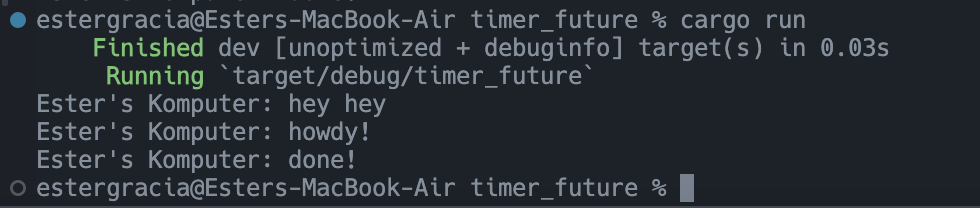

1. The result: 

The done appeared 2 seconds after howdy, as expected and similar to previous experiment. The intereseting part here is that hey hey appeared first before howdy, even though howdy is placed before hey hey on the code lines. Right after running the spawn line, the program immediately continue to the next line, which is printing hey hey (without waiting for the async to even start running it's line). The async which is running in the background apparently prints howdy later than hey hey. Maybe even the spawning of async took some time (creating new threads and such?) and it's also run in the background, so the main program can continue to the next line.